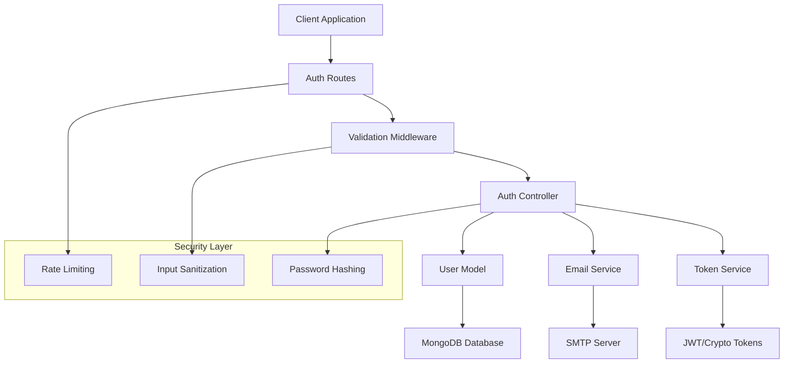

# Design Document

## Overview

This design implements a comprehensive email and password authentication system that integrates seamlessly with the existing Google OAuth authentication. The system provides secure user registration, login, password reset, and email verification functionality while maintaining compatibility with the current User model and authentication middleware.

## Architecture

### High-Level Architecture



### Integration Points

- **Existing User Model**: Extends current schema with email verification and password reset fields
- **Current Auth Middleware**: Leverages existing JWT authentication and authorization
- **Email Service**: Utilizes existing email infrastructure with new templates
- **Validation Middleware**: Extends current Joi validation schemas

## Components and Interfaces

### 1. Authentication Routes (`/api/auth`)

**New Endpoints:**
- `POST /register` - User registration with email/password
- `POST /login` - User login with email/password  
- `POST /forgot-password` - Request password reset
- `POST /reset-password` - Reset password with token
- `POST /verify-email` - Verify email with token
- `POST /resend-verification` - Resend verification email

**Enhanced Endpoints:**
- `POST /google` - Updated to handle email verification status
- `GET /profile` - Returns email verification status

### 2. Authentication Controller Extensions

```javascript
// New controller methods
const authController = {
  // Existing methods...
  googleAuth,
  getProfile,
  updateProfile,
  resetToGooglePicture,
  logout,
  
  // New methods
  register,           // Email/password registration
  login,             // Email/password login
  forgotPassword,    // Initiate password reset
  resetPassword,     // Complete password reset
  verifyEmail,       // Verify email address
  resendVerification // Resend verification email
};
```

### 3. Enhanced User Model

**New Fields:**
```javascript
{
  // Existing fields...
  
  // Email verification
  email_verified: { type: Boolean, default: false },
  email_verification_token: String,
  email_verification_expires: Date,
  
  // Password reset
  password_reset_token: String,
  password_reset_expires: Date,
  
  // Security
  login_attempts: { type: Number, default: 0 },
  account_locked_until: Date,
  last_login: Date,
  
  // Enhanced password field
  password: {
    type: String,
    required: function() {
      return !this.google_id; // Required if not Google user
    }
  }
}
```

### 4. Token Service

```javascript
const tokenService = {
  generateEmailVerificationToken,
  generatePasswordResetToken,
  verifyEmailToken,
  verifyPasswordResetToken,
  invalidateUserTokens
};
```

### 5. Enhanced Email Templates

**New Templates:**
- `emailVerification` - Welcome email with verification link
- `passwordReset` - Password reset instructions
- `passwordResetConfirmation` - Password successfully reset
- `accountLocked` - Account locked due to failed attempts
- `loginAlert` - Suspicious login activity

### 6. Security Middleware

```javascript
const securityMiddleware = {
  rateLimitAuth,        // Rate limit auth endpoints
  requireEmailVerified, // Require verified email
  checkAccountLocked,   // Check if account is locked
  logSecurityEvent     // Log security events
};
```

## Data Models

### Enhanced User Schema

```javascript
const userSchema = new mongoose.Schema({
  // Existing fields
  email: {
    type: String,
    required: true,
    unique: true,
    lowercase: true
  },
  first_name: { type: String, required: true },
  last_name: { type: String, required: true },
  user_type: {
    type: String,
    enum: ['system_admin', 'provider_admin', 'tourist'],
    default: 'tourist'
  },
  
  // Authentication fields
  password: {
    type: String,
    required: function() {
      return !this.google_id;
    }
  },
  google_id: String,
  
  // Email verification
  email_verified: { type: Boolean, default: false },
  email_verification_token: String,
  email_verification_expires: Date,
  
  // Password reset
  password_reset_token: String,
  password_reset_expires: Date,
  
  // Security tracking
  login_attempts: { type: Number, default: 0 },
  account_locked_until: Date,
  last_login: Date,
  
  // Existing fields...
  country: String,
  passport_number: String,
  date_of_birth: Date,
  gender: { type: String, enum: ['male', 'female', 'other'] },
  phone_number: String,
  profile_picture: String,
  provider_id: { type: mongoose.Schema.Types.ObjectId, ref: 'Provider' },
  is_active: { type: Boolean, default: true }
}, {
  timestamps: { createdAt: 'created_date', updatedAt: 'updated_date' }
});
```

### Security Event Log Schema

```javascript
const securityEventSchema = new mongoose.Schema({
  user_id: { type: mongoose.Schema.Types.ObjectId, ref: 'User' },
  event_type: {
    type: String,
    enum: ['login_success', 'login_failed', 'password_reset_requested', 
           'password_reset_completed', 'email_verified', 'account_locked']
  },
  ip_address: String,
  user_agent: String,
  metadata: mongoose.Schema.Types.Mixed,
  created_at: { type: Date, default: Date.now }
});
```

## Error Handling

### Error Response Format

```javascript
{
  error: "Error message",
  code: "ERROR_CODE",
  details: ["Detailed error information"],
  timestamp: "2024-01-01T00:00:00.000Z"
}
```

### Error Codes

- `AUTH_001` - Invalid credentials
- `AUTH_002` - Email not verified
- `AUTH_003` - Account locked
- `AUTH_004` - Invalid or expired token
- `AUTH_005` - Email already exists
- `AUTH_006` - Password requirements not met
- `AUTH_007` - Rate limit exceeded

### Security Error Handling

- Never reveal whether an email exists in the system
- Use consistent response times to prevent timing attacks
- Log all authentication attempts for security monitoring
- Implement progressive delays for failed attempts

## Testing Strategy

### Unit Tests

1. **Authentication Controller Tests**
   - Registration with valid/invalid data
   - Login with correct/incorrect credentials
   - Password reset flow
   - Email verification flow
   - Rate limiting behavior

2. **User Model Tests**
   - Password hashing and verification
   - Token generation and validation
   - Account locking mechanism
   - Email verification status

3. **Security Middleware Tests**
   - Rate limiting functionality
   - Account lock detection
   - Email verification requirements
   - Security event logging

### Integration Tests

1. **Complete Authentication Flows**
   - Full registration → verification → login flow
   - Password reset → new password → login flow
   - Account locking → unlock → login flow
   - Mixed Google OAuth and email/password users

2. **Security Tests**
   - Brute force protection
   - Token expiration handling
   - Cross-user token validation
   - Rate limiting across different IPs

### API Tests

1. **Endpoint Testing**
   - All new authentication endpoints
   - Error response validation
   - Rate limiting verification
   - Input validation testing

2. **Load Testing**
   - Authentication endpoint performance
   - Database query optimization
   - Email service reliability

## Security Considerations

### Password Security

- **Hashing**: bcrypt with minimum 12 salt rounds
- **Requirements**: Minimum 8 characters, mixed case, numbers, special characters
- **Storage**: Never store plain text passwords
- **Validation**: Server-side password strength validation

### Token Security

- **Email Verification**: Cryptographically secure random tokens, 24-hour expiry
- **Password Reset**: Cryptographically secure random tokens, 1-hour expiry
- **JWT Tokens**: Existing implementation with configurable expiry
- **Token Invalidation**: Invalidate all tokens on password reset

### Rate Limiting

- **Login Attempts**: 5 attempts per 15 minutes per IP
- **Registration**: 3 attempts per hour per IP
- **Password Reset**: 3 requests per hour per email
- **Email Verification**: 5 requests per hour per email

### Account Security

- **Account Locking**: Lock after 5 failed login attempts for 30 minutes
- **Progressive Delays**: Increase delay between failed attempts
- **Security Logging**: Log all authentication events
- **Suspicious Activity**: Alert on unusual login patterns

### Data Protection

- **Input Sanitization**: Sanitize all user inputs
- **SQL Injection**: Use parameterized queries (MongoDB)
- **XSS Prevention**: Escape output data
- **CSRF Protection**: Implement CSRF tokens for state-changing operations

## Performance Considerations

### Database Optimization

- **Indexes**: Email, verification tokens, reset tokens
- **Query Optimization**: Efficient user lookups
- **Connection Pooling**: Reuse database connections

### Caching Strategy

- **User Sessions**: Cache authenticated user data
- **Rate Limiting**: Use Redis for rate limit counters
- **Token Validation**: Cache valid tokens temporarily

### Email Performance

- **Queue System**: Asynchronous email sending
- **Template Caching**: Cache compiled email templates
- **Delivery Optimization**: Batch email operations

## Monitoring and Logging

### Security Monitoring

- Failed login attempts tracking
- Unusual access patterns detection
- Account lockout notifications
- Password reset frequency monitoring

### Performance Monitoring

- Authentication endpoint response times
- Database query performance
- Email delivery success rates
- Rate limiting effectiveness

### Audit Logging

- All authentication events
- Password changes
- Email verification status changes
- Administrative actions on user accounts